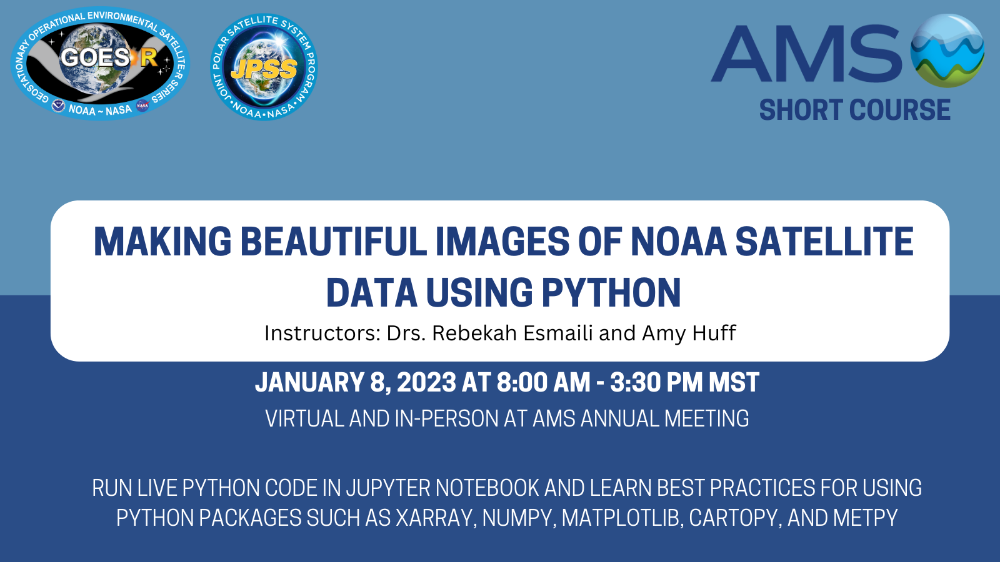

## Welcome!
Please see the [official course page](https://www.star.nesdis.noaa.gov/atmospheric-composition-training/training_AMS_Short_Course_2023.php) for the agenda, pre-training actions, and post-training materials.

Observations from NOAA’s geostationary (GOES-R) and polar-orbiting (JPSS) satellites provide vital information for a myriad of research and operational applications in Atmospheric and Oceanic Sciences. NOAA satellite data are distributed in netCDF4 (.nc) format, however, and the process of accessing the files and processing the contents correctly can be challenging. This short course will break down these barriers by teaching participants how to use Python to perform the basic steps necessary to work with NOAA netCDF4 satellite data files, with the end goal of making professional-quality imagery suitable for use in scientific presentations and journal articles, or in social media. 

## Pre-requisites

Participants in the Short Course will run live Python code using Jupyter Notebook. You must complete the following steps prior to the Course on January 8 to set up your computer! We recommend a machine running Windows or MacOS, because it is difficult to use Jupyter Notebook in Linux.

___Note: We understand that some may not have administrative permissions on their computer or have another problem during the class. You can run the course interactively on the cloud clicking on the following icon: [](https://mybinder.org/v2/gh/modern-tools-workshop/AMS-python-workshop-2023.git/HEAD). Binder does not require any installation, but any changes you make not be saved and your session will time out after 10 mins of inactivity.___

However, we recommend following the steps below so your computer is ready to go for all future Python endeavors!

### Step 1 Install Anaconda
If Anaconda is not installed your computer, follow these instructions to install it.
Anaconda is free for individual users. It comes bundled with the latest stable version of Python and ~1500 of the most widely used packages. Note: Anaconda requires ~3GB of free disk space.

### Step 2 Download the notes to your local machine

Download the contents of this repository (via the Code button --> .zip at the top right of this page)

The zip file contains the files we will use in the Short Course, including 6 .ipynb files (Jupyter Notebook formatted Python files) and 1 .yml file (YAML Ain’t Markup Language environment configuration file):

* abi_rgb.ipynb
* check_python_packages.ipynb
* download_satellite_data.ipynb
* environment.yml
* nucaps_skewt.ipynb
* viirs_aerosol.ipynb
* viirs_fire.ipynb

### Step 3: Install required packages (If you're running Python > 3.8)

The Short Course will use four Python packages that are not part of the standard Anaconda installation.

#### Option 1: Install into your base environment

You can install the packages individually in your base environment. We recommend learning [how to use environments](https://conda.io/projects/conda/en/latest/user-guide/tasks/manage-environments.html) as you progress in your Python journey, but we the following steps may be simpler for new to intermediate users.

The following packages must be installed individually:

* netCDF4 version 1.5.7
* Cartopy version 0.18.0
* S3Fs version 2022.5.0
* MetPy version 1.30

It is important that you follow the directions below to install the specified versions of these three packages; the code used in the Short Course was written with these package versions. They are recent versions but are NOT the current (most up-to-date) versions available. Python is a very dynamic language, so packages update often.

If you already have these packages installed, please check that they are the recommended version number.

Instructions to Install Packages:
* Windows users: go to Start → Anaconda3 → Anaconda Powershell Prompt
* Mac/Linux users: open the terminal

Type (or copy and paste) the following commands into the terminal window one at a time and hit Enter:

```bash
conda install netCDF4=1.5.7
conda install -c conda-forge cartopy=0.18.0
pip install s3fs==2022.5.0
pip install metpy==1.30
```

After you type the install command and hit Enter, the terminal should begin preparing to install the package. You will be asked whether you want to proceed:

```
Proceed (y/n)?
```

Type the letter "y" and press Enter, and the package should begin downloading.


NOTE: You may see an error message when installing "s3fs" related to the dependencies for the package "botocore". You can ignore this message; it won't affect the code we use in the Short Course.

#### Option 2: Create a new environment

Alternatively, if you are comfortable setting up Python environments (or interested in learning!), use the ```environment.yml``` file downloaded in Step 2 to set up the "python-workshop" environment.

The environment will install all the necessary packages to run the workshop.

```
cd to/location/of/enviromment.yml
conda env create -f environment.yml
```

Once it's done, type:

```
conda activate python-workshop
```

**This step might not work if you don't have admin privileges:**

Then you can launch Jupyter Notebook in the new (python-workshop) environment

```
jupyter notebook
```

Then run a check of the packages in ```check_python_packages.ipynb```.

**If the above step failed...**

You can also run Jupyter Notebooks in your base environment but access the libraries in the environment you created:

Make sure you're in the base environment:

```
conda activate base
```

Install some jupyter add-ons into your base environment:

```
conda install nb_conda_kernels
```

### Step 4 If you are running Python < 3.8 (otherwise, skip to step 5)

Users running an older version of Python (3.8 or older): The Short Course will use three packages that are part of the standard Anaconda installation, so they should already be installed on your computer. Depending on the version of Python you have installed, however, you may need to update these packages:

* Matplotlib version 3.5.1
* Xarray version 0.20.1
* Requests version 2.27.1

To update any of these packages, follow the instructions in Step 3 to open the Anaconda Powershell Prompt or terminal window and type the following (or copy and paste) for the appropriate package(s) one at a time and then hit Enter:

```bash
conda install matplotlib=3.5.1
pip install xarray==0.20.1
pip install requests==2.27.1
```

When asked if you want to proceed, type the letter "y" and press Enter, and the package should begin downloading.


### Step 5 Set up Jupyter Notebook for the Short Course

* Follow [these instructions](https://www.star.nesdis.noaa.gov/atmospheric-composition-training/software_jupyter_notebook_set-up.php#launch_jupyter_notebook) to launch Jupyter Notebook on your computer.
* Follow [these instructions](https://www.star.nesdis.noaa.gov/atmospheric-composition-training/software_jupyter_notebook_set-up.php#new_folder_upload_files) to make a new folder in Jupyter Notebook and upload to it the 6 Python files (.ipynb) you downloaded in Step 2.
* Follow [these instructions](https://www.star.nesdis.noaa.gov/atmospheric-composition-training/software_jupyter_notebook_set-up.php#check_packages) to check that the additional packages installed in Step 3 were installed properly, and check that installed package versions match the recommendations listed in Steps 3 & 4 (including Matplotlib, Xarray, and Requests).

Step 6 Watch these two short videos (optional but recommeded)

These videos provide important background information on NOAA satellites that won't be covered in the Short Course:
* [GOES-R Series Satellites and the ABI Sensor](https://youtu.be/iD6QQOmO6FA) (9 min)
* [JPSS Satellites and the VIIRS Sensor](https://youtu.be/bZR1E_OZupQ) (7.5 min)

## Introduction

[Here are some introduction slides](https://www.canva.com/design/DAFU3XviLUM/mkORYrU5Zu7hGTyPo9mgEw/view?utm_content=DAFU3XviLUM&utm_campaign=designshare&utm_medium=link&utm_source=publishpresent) that we'll present before getting started.

First we ask, what makes an image beautiful? 

### What makes a beautiful image?
Creating a beautiful image is not about making a "work of art" (although some are!), but rather adhere to the following principles:

1. The image has a **purpose** - the viewer knows what they're looking at and why
2. The image is **well-composed** - are the elements arranged in a way that it makes the purpose more clear. Text and lines are readable and take up appropriate space on graphic
3. **Colors** focus what is important (and are accessible!) which again, furthers the purpose
4. The image shows **clarity**, the viewer easily understands what they're looking at

 We recommend you read Simplified Sciences's guide on [How to Make Good Graphs and Figures for Scientific Papers](https://www.simplifiedsciencepublishing.com/resources/how-to-make-good-graphs-and-figures-for-scientific-papers) to learn more!

### How can I share my beautiful image?
Sharing figures has always been a part of the scientific process and here are some applications:

* Research publications
* Social media - discuss major weather events with peers and engage with the public
* Graphical abstracts - increasingly required by journals
* Blog posts, newsletters, white papers. AMS requests extended abstracts after the conference, can apply what you learned

### What are the steps to creating a beautiful image?
We break the typical workflow down into 8 steps, depending on your plot:

Steps:
0. Read dataset documentation
1. Launch Jupyter Notebook
2. Download satellite data file(s)
3. Understand the structure and contents of file
4. Handle data arrays
5. Make composite (RGB) image
6. Work with map projections
7. Add professional touches to maps
8. Create a Skew-T plot from satellite soundings

We will apply this workflow to a variety of sensors and satellites: imagers, sounder, geo orbits, and leo orbits!!

## Getting started

1. Check that you **installed the right packages** by launching jupyter notebooks and running the ```check_python_packages.ipynb``` notebook. If there are no errors, fantastic!

2. you'll need to **download the datasets**. Work through the ```download_satellite_data.ipynb``` notebook; this will save a local copy of all the datasets used in the tutorial.

3. Each of the remaining notebook contains the **full workflow for a single "beautiful" image**. You can work through them in any order if you are doing this course on your own time. The notebooks/images are:

* ```viirs_aerosol.ipynb```: Global L3 AOD from VIIRS
* ```abi_rgb.ipynb```: DustRGB from GOES-16 ABI channels
* ```nucaps_skewt.ipynb```: NUCAPS Skew-T from CrIS/ATMS on NOAA-20
* ```viirs_aerosol.ipynb```: L2 Active Fire from the VIIRS I-band

## Course Philosophy

* Increase accessibility of NOAA satellite data and lower barriers to analysis
* Promote the proper use of the satellite products in operations and research
* Teach Python using practical examples and real-world satellite datasets

## Acknowledgements

* The live course received generous support from Lockheed Martin Corp. to subsidize tuition costs
* We would like to acknowledge the JPSS and GOES-R liaisons, Steve Goodman, Sherrie Morris, Bill Sjoberg, and Gary McWilliams
* Gian Dilawari and Lihang Zhou for their quick turnaround for preparing resources in the NOAA Open Data Dissemination (NODD) program for this short course
* Assistance during the short course by Philip Casey
